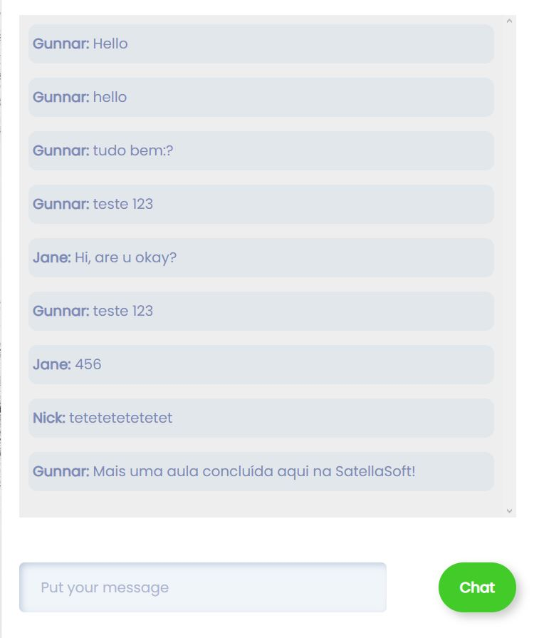

# PHP Chat

Conteúdo criado nas aulas da SatellaSoft. 

O projeto utiliza ```PHP``` e ```Javascript``` como linguagem base para o projeto. Também utilizamos o ```HTML``` e ```CSS```. Toda a persistência é feita em arquivo texto(.txt).

Para rodar o projeto, você pode iniciar um servidor PHP e depois abrir o endereço localhost:8000 no seu navegador.

```shell
php -S localhost:8000
```

## Links 
- Vídeo aula: https://youtu.be/5qEVURx8Y3Q
- Artigo complementar: https://satellasoft.com/artigo/php/chat-de-mensagens-com-php-e-javascript-sem-utilizar-banco-de-dados
- Nossos cursos: https://academy.satellasoft.com


